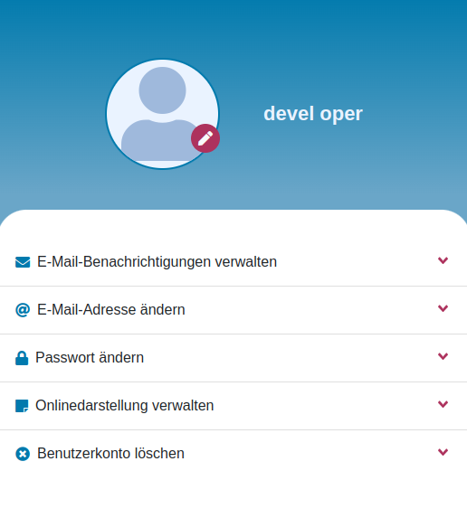

Der Link von der Aufgabe: [klick](https://test-aufgabe.vercel.app/)

# Testaufgabe

- Sie sehen eine Dropdown-Menu und Header.
- Sie können alle Dropdown-Menüs öffnen und schließen. 
- Wenn Sie „E-Mail-Adresse ändern“ Button klicken, öffnen sich ein Popup-Fenster.
- Hier können Sie Ihre neue E-Mail-Adresse eingeben. Ihre E-Mail-Adresse soll gültig sein.
- Wenn Sie ungültige E-Mail-Adresse eingeben, erhalten Sie eine Flash-Message für jeden Zustand mit unterschiedlichem Inhalt und unterschiedlicher Farbe. 
- Nachdem Sie „Speichern“ Button geklickt haben, schlißt sich das Popup-Fenster und können Sie Ihre neue E-Mail-Adresse sehen.

### Tools

- React
- Font Awesome
- Bootstrap

### Verwendeten Farbcodes

- blauer Farbcode = #007AAD
- roter Farbcode = #AD325D

### Bildschirm von Desktop
 

### Bildschirm von Mobile

